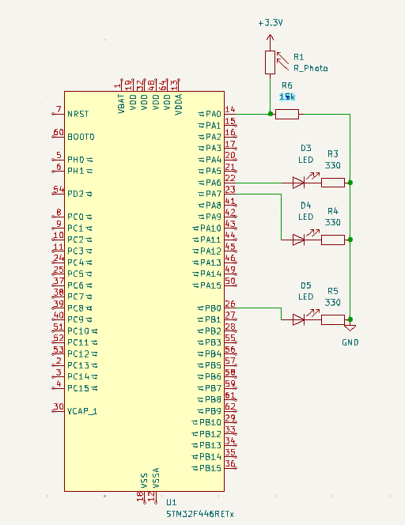
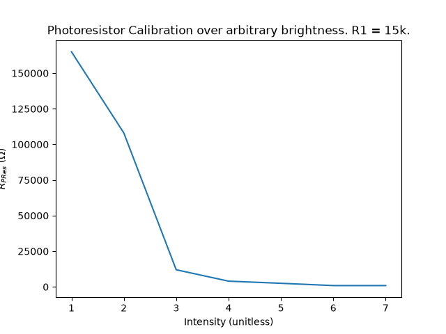
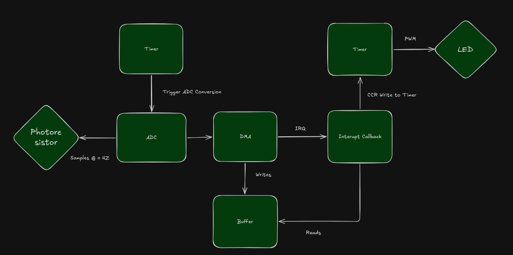

# Nightlight: Event-Driven Ambient Light Controller on STM32F446RE

**Demo video:** [docs/demo.mp4](docs/demo.mp4) 

## Overview

This nightlight measures room darkness with a photoresistor and fades in red, yellow, and green LEDs in three stages as the room gets darker. It is fully event-driven on an STM32F446RE. A single interrupt callback converts each sampling window to photoresistor resistance, maps it to a normalized darkness value, and updates three 16-bit PWM channels, while the main loop sleeps on `__WFI()`. A DAC self-test verifies the ADC signal path using on board traces.

**Demo video:** [docs/demo.mp4](docs/demo.mp4) 

## Circuit



### Components

| Ref | Part | Value |
|:-|:-|:-|
| LDR1 | Photoresistor | Characterized below |
| R1 | Divider resistor | 15 kΩ |
| R2, R3, R4 | LED series resistors | TODO Ω |
| LED1 | Stage 1 LED | TODO color |
| LED2 | Stage 2 LED | TODO color |
| LED3 | Stage 3 LED | TODO color |

### Pin map

| Signal | MCU pin | Nucleo header | Function |
|:-|:-|:-|:-|
| Sensor | PA0 | A0 (CN8) | ADC1_IN0 |
| Self-test loopback | PA4 | A2 (CN8), unconnected | DAC_OUT1 / ADC1_IN4 |
| LED stage 1 | PA6 | D12 (CN5) | TIM3_CH1, AF2 |
| LED stage 2 | PA7 | D11 (CN5) | TIM3_CH2, AF2 |
| LED stage 3 | PB0 | A3 (CN8) | TIM3_CH3, AF2 |
| Sensor supply | 3V3 | CN6 | |
| Ground | GND | CN6 | |


### Divider design

The photoresistor sits on top, so the ADC code rises with light:

$$c = 4096 \cdot \frac{R_{DIV}}{R_{LDR} + R_{DIV}}$$

For maximum voltage swing across the operating range, $R_{DIV} \approx \sqrt{R_{bright} R_{dark}}$.


## Sensor Characterization

### Method
LDR resistance was measured with a multimeter under different light sources of increasing brightness. 




The relationship is not linear. On log-log axes the data falls on a straight line, so the photoresistor follows a power law:

$$R = A \cdot L^{-\gamma}$$


Because $\ln R$ is linear in $\ln L$, and light intensity is roughly logarithmic, only the two calibration endpoints, max and min are needed

## System Architecture



### Data flow

1. **TIM2** counts at 1 MHz effective and overflows every 833 µs. Each update event drives TRGO, which starts one ADC conversion in hardware.
2. **ADC1** converts PA0 with a 480-cycle sample time .
3. **DMA2 Stream 0** copies each result into a 120-entry circular buffer. 
4. When either half of the buffer fills, the DMA raises an interrupt and HAL calls the half-complete or complete callback.
5. **The callback** averages 60 samples, converts to resistance, maps to darkness, splits into three stages, and writes TIM3 CCR1 to CCR3.
6. **TIM3** generates three PWM waveforms continuously. 

### Brightness mapping

Average ADC sample output is converted to resistance:

$$R = R_{DIV}\,\frac{4096 - c}{c}$$

The resistance is converted to a "darkness" value to be normalized and processed by the 

$$d = \operatorname{clamp}\!\left(\frac{\ln R - \ln R_{bright}}{\ln R_{dark} - \ln R_{bright}},\ 0,\ 1\right)$$

Darkness to stage $k = 0, 1, 2$:

$$s_k = \operatorname{clamp}(3d - k,\ 0,\ 1), \qquad \text{CCR}_{k+1} = 65535 \cdot s_k$$

Calibration: $R_{bright}$ = 2000 Ω, $R_{dark}$ = 8000 Ω.

## Design Decisions

| Constant | Value | Rationale |
|:-|:-|:-|
| System clock | 180 MHz from internal HSI | Maximum rated speed |
| ADC clock | 22.5 MHz (PCLK2 / 4) | Fastest sample setting |
| Sampling rate | 1200 Hz | 60 samples per 50 ms |
| ADC sample time | 480 cycles | Arbitrary |
| Buffer | 120 samples, two halves | 20 Hz update rate. CPU reads the half DMA does not write to.|
| PWM frequency | 1373 Hz | Arbitrary |
| Filtering | 60-sample average only | Average sample reduces jitter in PWM|
| LED color order | Red, Yellow, Green | Based on what humans best see in different levels of light |

## Register Trace

Each CubeMX setting and the register field it writes. HAL source was used to find the fields; each was verified against RM0390.

### ADC1

ADC1 converts the sensor on PA0 once per TIM2 trigger.

| CubeMX setting | Value | Register.field = value |
|:-|:-|:-|
| Clock Prescaler | PCLK2 / 4 | ADC_CCR.ADCPRE = 01 |
| Resolution | 12 bit | ADC_CR1.RES = 00 |
| Scan Conversion | Disabled | ADC_CR1.SCAN = 0 |
| Continuous Conversion | Disabled | ADC_CR2.CONT = 0 |
| Data Alignment | Right | ADC_CR2.ALIGN = 0 |
| DMA Continuous Requests | Enabled | ADC_CR2.DDS = 1 |
| DMA enable | (at start) | ADC_CR2.DMA = 1 |
| EOC Selection | Single conversion | ADC_CR2.EOCS = 1 |
| External Trigger | TIM2 TRGO | ADC_CR2.EXTSEL = 0110 |
| Trigger Edge | Rising | ADC_CR2.EXTEN = 01 |
| Number of Conversions | 1 | ADC_SQR1.L = 0000 |
| Rank 1 Channel | 0 | ADC_SQR3.SQ1 = 0 |
| Rank 1 Sample Time | 480 cycles | ADC_SMPR2.SMP0 = 111 |
| Self-test channel | 4 (flag only) | ADC_SQR3.SQ1 = 4, ADC_SMPR2.SMP4 = 111 |

### DMA2 Stream 0

DMA2 Stream 0 moves every ADC result into a 120-sample circular buffer and interrupts at each half.

| CubeMX setting | Value | Register.field = value |
|:-|:-|:-|
| Request | ADC1 | DMA_S0CR.CHSEL = 000 |
| Direction | Peripheral to memory | DMA_S0CR.DIR = 00 |
| Mode | Circular | DMA_S0CR.CIRC = 1 |
| Memory increment | On | DMA_S0CR.MINC = 1 |
| Peripheral increment | Off | DMA_S0CR.PINC = 0 |
| Data width | Half word | DMA_S0CR.PSIZE = 01, MSIZE = 01 |
| Priority | High | DMA_S0CR.PL = 10 |
| FIFO | Off | DMA_S0FCR.DMDIS = 0 |
| Length | 120 (at start) | DMA_S0NDTR = 120 |

### TIM2 (ADC trigger)

TIM2 paces the ADC at 1.2 kHz:

| CubeMX setting | Value | Register.field = value |
|:-|:-|:-|
| Prescaler | 74 | TIM2_PSC = 74 |
| Counter Period | 999 | TIM2_ARR = 999 |
| Counter Mode | Up | TIM2_CR1.DIR = 0 |
| Auto-reload preload | Enable | TIM2_CR1.ARPE = 1 |
| Trigger Event (TRGO) | Update | TIM2_CR2.MMS = 010 |

### TIM3 (LED PWM)

TIM3 drives the three LEDs with 1373 Hz, 16-bit PWM.

| CubeMX setting | Value | Register.field = value |
|:-|:-|:-|
| Prescaler | 0 | TIM3_PSC = 0 |
| Counter Period | 65535 | TIM3_ARR = 0xFFFF |
| Auto-reload preload | Enable | TIM3_CR1.ARPE = 1 |
| PWM Mode | PWM mode 1 | TIM3_CCMR1.OC1M/OC2M = 110, TIM3_CCMR2.OC3M = 110 |
| Output compare preload | Enable | OC1PE/OC2PE/OC3PE = 1 |
| Polarity | High | TIM3_CCER.CCxP = 0 |
| Output enable | (at start) | TIM3_CCER.CCxE = 1 |
| Pins | AF2 | GPIOA_AFRL.AFRL6/7 = 0010, GPIOB_AFRL.AFRL0 = 0010 |

### DAC (self-test)

The DAC drives known voltages onto PA4 for the loopback self-test and is only used when `ENABLE_DAC_SELFTEST` is 1.

| CubeMX setting | Value | Register.field = value |
|:-|:-|:-|
| Output buffer | Enable | DAC_CR.BOFF1 = 0 |
| Trigger | None | DAC_CR.TEN1 = 0 |
| Enable | (at start) | DAC_CR.EN1 = 1 |
| Data | per step | DAC_DHR12R1 |

## Testing

### DAC self-test

With `ENABLE_DAC_SELFTEST = 1`, ADC1 reads channel 4 (PA4). Each DMA callback averages 60 samples of the code written by the previous callback, compares, and writes the next code. Because the DAC and ADC share VREF+, the expected ADC code equals the DAC code.

 With the output buffer enabled, the DAC only swings from 0.2 V to $V_{DDA} - 0.2$ V (datasheet Table 85), about codes 248 to 3848, so codes near the rails are excluded.

**Tolerance.**:

| Source | Spec | LSB |
|:-|:-|:-|
| DAC offset | ±10 mV (Table 85) | ±12.4 |
| DAC gain | ±0.5% (Table 85) | ±0.005 × code |
| DAC INL | ±4 LSB (Table 85) | ±4 |
| ADC total unadjusted error | ±5 LSB (Table 76) | ±5 |

$$\text{tol}(n) = \lceil 21.4 + 0.005\,n \rceil\ \text{LSB}$$

**Results.**

| DAC code | ADC measured | Error (LSB) | Tolerance (LSB) | Pass |
|:-|:-|:-|:-|:-|
| 300 | 281 | -19 | 23 | ✓ |
| 750 | 738 | -12 | 26 | ✓ |
| 1200 | 1194 | -6 | 28 | ✓ |
| 1650 | 1654 | 4 | 30 | ✓ |
| 2100 | 2111 | 11 | 32 | ✓ |
| 2550 | 2568 | 18 | 35 | ✓ |
| 3000 | 3024 | 24 | 37 | ✓ |
| 3450 | 3479 | 29 | 39 | ✓ |
| 3800 | 3835 | 35 | 41 | ✓ |

## Obstacles

The first run of the DAC  self-test failed. The DAC stepped from 300 to 3800, but the ADC read about 1699 counts for all nine steps. A reading that does not move at all while the input sweeps the full range meant the ADC was not looking at the DAC. 1699 counts corresponds to about 21 kΩ on the 15 kΩ divider, a normal room-light value for the photoresistor, so the ADC was most likely still sampling PA0 instead of PA4. Covering the sensor shifted the "measured" values, which confirmed it. In the STM32CubeIDE SFR view, ADC1_SQR3.SQ1 read 0 instead of 4.

The code that switches rank 1 to channel 4 was in `USER CODE BEGIN ADC1_Init 1`. That block runs before `HAL_ADC_Init` and before CubeMX's generated channel 0 configuration, so the generated code silently overwrote my setting every boot. 

In a CubeMX project, which USER CODE block a line goes in decides when it runs relative to the generated initialization. The source looked correct; only reading the register showed what the hardware was actually configured to do.

## Build and Run

1. Open the project in STM32CubeIDE.
2. In `main.c`, set `ENABLE_DAC_SELFTEST` to `0` for normal operation or `1` for the self-test.
3. Set `R_BRIGHT_OHMS` and `R_DARK_OHMS` to your calibration values.
4. Build and flash. With the self-test enabled, inspect `st_results` and `st_pass` in Live Expressions.

## Repository Structure

```
.
├── Core/              CubeMX-generated sources; application code in main.c USER CODE blocks
├── Drivers/           HAL and CMSIS
├── docs/              Photos, schematic, plots, architecture diagram, demo video
├── characterization/  TODO: raw data and plotting script
├── nightlight.ioc     CubeMX configuration
└── README.md
```
